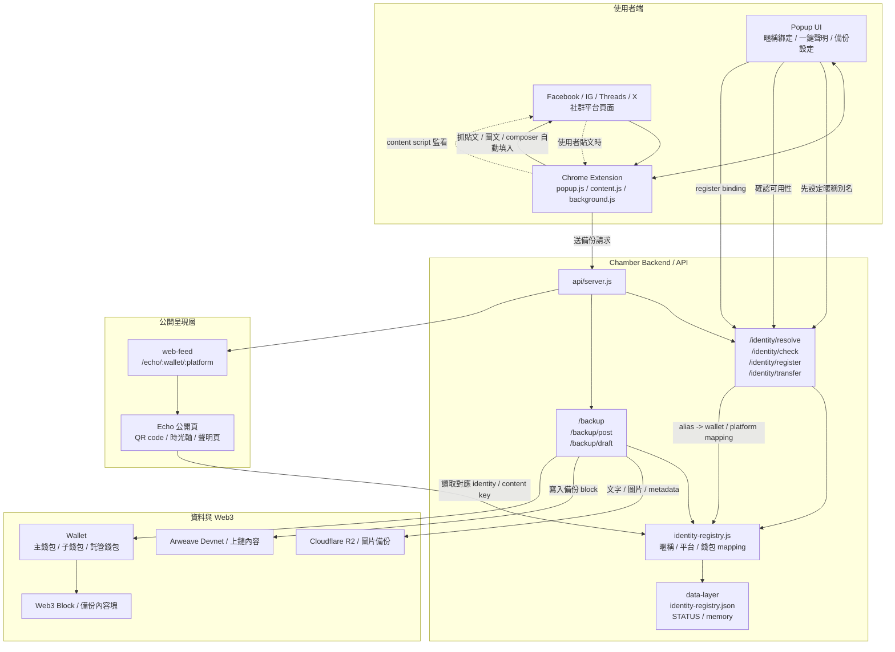

# Chamber / Metashield Protocol Architecture

這份文件描述整套系統的資料流與責任分工，包含 `extension`、`backend`、`web3` 與公開網頁。

## Overview

## Component Roles

- `extension`
  - `content.js`: 掃描貼文、注入備份按鈕、開發文框、填入圖文
  - `background.js`: 接收備份事件、整理 payload、呼叫 backend
  - `popup.js`: 暱稱綁定、錢包設定、聲明生成、使用者入口
- `backend`
  - `api/server.js`: 對外 API
  - `identity-registry.js`: 管理 alias / platform / wallet mapping
  - `identity-registry.json`: 持久化 registry 資料
- `web3`
  - 保存備份內容、ownership、轉移紀錄與內容塊
- `web`
  - 公開 Echo 頁面
  - 依 mapping 顯示對應時光軸與 QR code

## Flow Summary

1. 使用者在 `popup` 先設定身份暱稱。
2. `backend` 檢查 alias 是否可用，並建立 `alias -> platform -> wallet` mapping。
3. `extension` 讀取 mapping 後，才開放一鍵聲明與備份。
4. 使用者在社群平台發文時，`content.js` 自動填入圖文。
5. `background.js` 把備份內容送到 `backend`。
6. `backend` 寫入 Web3 / 儲存圖片 / 更新 identity registry。
7. `web-feed` 讀取對應身份，公開顯示 Echo 頁面與 QR code。

## Notes

- 這份圖是「現況與目標流程」的合併版，適合拿來做團隊溝通。
- 如果之後要更細，可以再拆成：
  - `extension` 時序圖
  - `identity binding` 狀態圖
  - `backup` 寫入流程圖
  - `wallet transfer` / ownership 轉移圖
