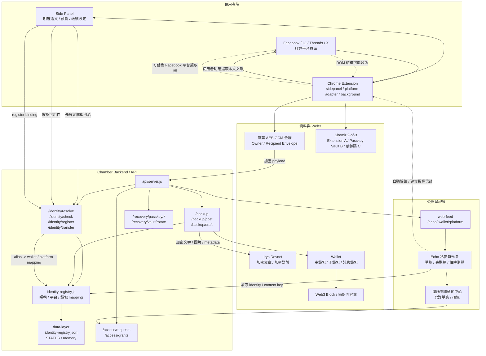

# Chamber / Metashield Protocol Architecture

這份文件描述整套系統的資料流與責任分工，包含 `extension`、`backend`、`web3` 與公開網頁。

## Overview

## Component Roles

- `extension`
  - `sidepanel.js`: 選文、預覽、帳號設定、備份結果入口
  - `platform-facebook.js`: Facebook 文章定位、作者／永久連結／文字／相簿擷取
  - `platform-threads.js`: Threads 文章定位、handle 作者驗證、永久連結、文字／多圖／影片封面擷取；與 Facebook adapter 共用相同輸出契約
  - `background.js`: 每篇 AES-GCM 金鑰、owner/recipient envelope、本機加解密、媒體上傳、備份 API 呼叫
  - `secret-sharing.js`: 2-of-3 Shamir 復原份額拆分與組合
  - `content.js`: Facebook 與 Echo 頁面的擴充功能訊息橋接
- `backend`
  - `api/server.js`: 對外 API
  - `api/access-store.js`: off-chain 閱讀申請、owner capability 雜湊與核准授權信封索引
  - `api/recovery-vault.js`: WebAuthn Passkey 驗證、加密保存份額 B、災難還原後輪替 Vault 份額。WebAuthn user verification 採 `preferred`，但仍要求使用者在 authenticator 中確認；完整還原仍需 B+C 或 A+B。Echo 預設走標準 WebAuthn，支援 Bitwarden、1Password 等提供者；使用者也可選擇由 Chamber content script 隔離環境呼叫原生 WebAuthn，作為 Windows Hello／Chrome 備援。
  - `identity-registry.js`: 管理 alias / platform / wallet mapping
  - `identity-registry.json`: 持久化 registry 資料
- `web3`
  - 目前固定 Irys Devnet；保存不可變的加密文章、媒體交易與版本 metadata
- `web`
  - Echo 依 mapping 顯示單篇或完整時光牆
  - Echo 是官方閱讀器而非資料儲存位置；文章與媒體可由交易 ID 直接從 Irys/Arweave gateway 取得
  - 登入身分相符時自動透過擴充功能解鎖；網站不持有解密金鑰
  - 閱讀申請、通知與核准均在 Echo 操作；Extension 只在本機解開文章金鑰並為收件者產生授權信封
  - `Is-Debug` 是舊交易相容欄位，不再控制使用者可見性

## Flow Summary

1. 使用者從 Echo 建立 2-of-3 復原組；Extension 保存 A，Recovery Vault 加密保存 B 並由 Passkey 保護，使用者離線保存 C。同裝置可用 A+C；Extension 遺失後通過 Passkey 取得 B，再用 B+C。
2. `backend` 檢查 alias 是否可用，並建立 `alias -> platform -> wallet` mapping。
3. 使用者在 Facebook 或 Threads 明確選取自己的文章；Side Panel 依目前網域載入可替換的平台 adapter，取得文字、永久連結、時間與支援媒體。
4. `background.js` 為新文章產生獨立內容金鑰，加密文字與媒體，再以 owner envelope 包住文章金鑰後送到 backend。
5. backend 將媒體交易與文章交易寫入 Irys Devnet，並回傳 TxID 與 Echo 連結。
6. Echo 讀取加密交易；Extension 身分與作者相符時自動解鎖目前時光牆，相簿採分批平行解密。
7. 同來源再次備份會建立新交易；一般時光牆顯示最新版本，歷史模式保留舊版本。
8. 收件者可在 Echo 申請閱讀；作者於 Echo 核准後，Extension 以收件者的 P-256 公鑰產生單篇 recipient envelope，收件者不會取得作者的復原金鑰。

## Notes

- 這份圖描述目前測試版；主網、完整影片備份、使用者付費與跨平台發佈仍屬未來版本。
- `0.6.0` 是 Facebook 穩定封測基線；Threads 在 `0.7.x` 候選線驗證，真實頁面驗收矩陣見 [`docs/threads-0.7-validation.md`](threads-0.7-validation.md)。
- 資料可攜性、直接交易存取方式與第三方閱讀器最小實作見 [`docs/data-portability.md`](data-portability.md)。
- Echo mainnet 的官方網站與客戶端不以 DNS 作為最終信任來源。規劃中的 Genesis Anchor 會固定協定身分、治理規則與簽署式 Root Manifest；完整規格與實作里程碑見 [`docs/echo-genesis-root.md`](echo-genesis-root.md)。
- 如果之後要更細，可以再拆成：
  - `extension` 時序圖
  - `identity binding` 狀態圖
  - `backup` 寫入流程圖
  - `wallet transfer` / ownership 轉移圖
